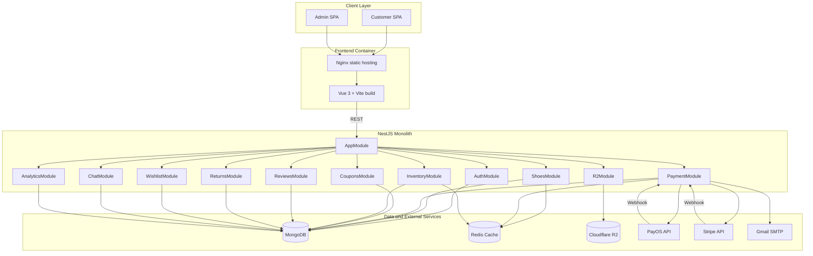
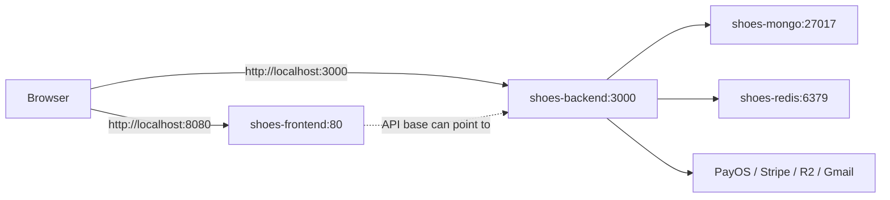
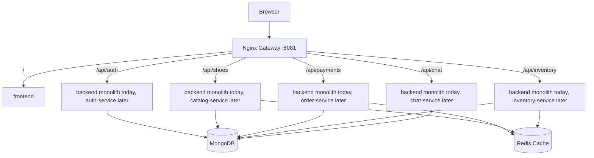

# System Architecture Diagram

## Current Modular Monolith

## Docker Compose Architecture

## Microservice-Ready Gateway Architecture

The current `docker-compose.microservices.yml` keeps the backend as one service, but introduces a gateway that can later route modules to extracted services.

## Recommended Future Service Split

| Service | Owns | Extract When |
| --- | --- | --- |
| Identity Service | Users, roles, JWT/session policy | Admin/user management needs independent scaling or stricter security boundary |
| Catalog Service | Shoes, categories, R2 media metadata | Product search/filter volume grows |
| Order Service | Bills, fulfillment, returns, reviews eligibility | Payment/order workflows need independent release cycle |
| Payment Service | PayOS/Stripe integration and webhook verification | Provider logic becomes complex or needs PCI-oriented isolation |
| Inventory Service | Stock and movements | Real-time stock reservations or warehouse integration appears |
| Support Service | Chat conversations | Chat moves to WebSocket or external support integration |
| Analytics Service | Aggregated metrics | Reporting workloads affect transactional APIs |
