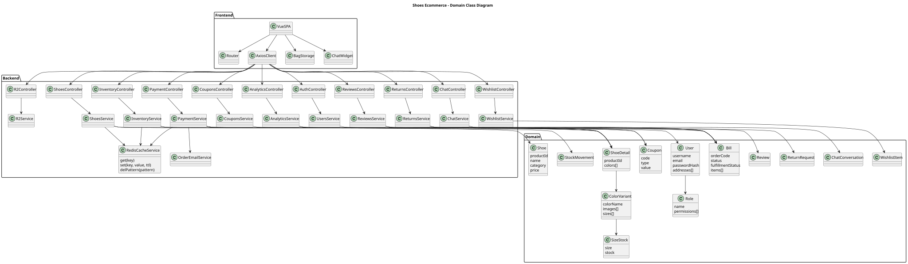

# Class Diagrams

## Overall Domain Class Diagram

Redis cache is represented in the overall domain diagram through `RedisCacheService`, used by `ShoesService` for catalog reads and by `PaymentService`/`InventoryService` for stock-change invalidation.

## Class Diagram by Use Case

| UC | Use case | Category | SVG | PlantUML |
| --- | --- | --- | --- | --- |
| UC-01 | Browse Products | Browsing & Discovery | [SVG](uml/class-svg/UC-01_Browse_Products_Class.svg) | [PUML](uml/class-puml/UC-01_Browse_Products_Class.puml) |
| UC-02 | Search/Filter Products | Browsing & Discovery | [SVG](uml/class-svg/UC-02_Search_Filter_Products_Class.svg) | [PUML](uml/class-puml/UC-02_Search_Filter_Products_Class.puml) |
| UC-03 | View Product Detail | Browsing & Discovery | [SVG](uml/class-svg/UC-03_View_Product_Detail_Class.svg) | [PUML](uml/class-puml/UC-03_View_Product_Detail_Class.puml) |
| UC-04 | Check Stock Real-time | Browsing & Discovery | [SVG](uml/class-svg/UC-04_Check_Stock_Real_time_Class.svg) | [PUML](uml/class-puml/UC-04_Check_Stock_Real_time_Class.puml) |
| UC-05 | View Reviews | Browsing & Discovery | [SVG](uml/class-svg/UC-05_View_Reviews_Class.svg) | [PUML](uml/class-puml/UC-05_View_Reviews_Class.puml) |
| UC-06 | Add Product to Cart | Shopping Cart | [SVG](uml/class-svg/UC-06_Add_Product_to_Cart_Class.svg) | [PUML](uml/class-puml/UC-06_Add_Product_to_Cart_Class.puml) |
| UC-07 | Manage Shopping Cart | Shopping Cart | [SVG](uml/class-svg/UC-07_Manage_Shopping_Cart_Class.svg) | [PUML](uml/class-puml/UC-07_Manage_Shopping_Cart_Class.puml) |
| UC-08 | Apply Coupon Code | Shopping Cart | [SVG](uml/class-svg/UC-08_Apply_Coupon_Code_Class.svg) | [PUML](uml/class-puml/UC-08_Apply_Coupon_Code_Class.puml) |
| UC-09 | Guest Checkout | Checkout & Payment | [SVG](uml/class-svg/UC-09_Guest_Checkout_Class.svg) | [PUML](uml/class-puml/UC-09_Guest_Checkout_Class.puml) |
| UC-10 | PayOS Payment Processing | Checkout & Payment | [SVG](uml/class-svg/UC-10_PayOS_Payment_Processing_Class.svg) | [PUML](uml/class-puml/UC-10_PayOS_Payment_Processing_Class.puml) |
| UC-11 | Stripe Payment Processing | Checkout & Payment | [SVG](uml/class-svg/UC-11_Stripe_Payment_Processing_Class.svg) | [PUML](uml/class-puml/UC-11_Stripe_Payment_Processing_Class.puml) |
| UC-12 | Receive Payment Webhook | Checkout & Payment | [SVG](uml/class-svg/UC-12_Receive_Payment_Webhook_Class.svg) | [PUML](uml/class-puml/UC-12_Receive_Payment_Webhook_Class.puml) |
| UC-13 | Track Order by Email + Order Code | Order Tracking | [SVG](uml/class-svg/UC-13_Track_Order_by_Email_Order_Code_Class.svg) | [PUML](uml/class-puml/UC-13_Track_Order_by_Email_Order_Code_Class.puml) |
| UC-14 | Register New Account | Account Management | [SVG](uml/class-svg/UC-14_Register_New_Account_Class.svg) | [PUML](uml/class-puml/UC-14_Register_New_Account_Class.puml) |
| UC-15 | User Login | Account Management | [SVG](uml/class-svg/UC-15_User_Login_Class.svg) | [PUML](uml/class-puml/UC-15_User_Login_Class.puml) |
| UC-16 | Manage User Profile | Account Management | [SVG](uml/class-svg/UC-16_Manage_User_Profile_Class.svg) | [PUML](uml/class-puml/UC-16_Manage_User_Profile_Class.puml) |
| UC-17 | Manage Addresses | Account Management | [SVG](uml/class-svg/UC-17_Manage_Addresses_Class.svg) | [PUML](uml/class-puml/UC-17_Manage_Addresses_Class.puml) |
| UC-18 | User (Logged-in) Checkout | Checkout & Payment | [SVG](uml/class-svg/UC-18_User_Logged_in_Checkout_Class.svg) | [PUML](uml/class-puml/UC-18_User_Logged_in_Checkout_Class.puml) |
| UC-19 | View Order History | Order Tracking | [SVG](uml/class-svg/UC-19_View_Order_History_Class.svg) | [PUML](uml/class-puml/UC-19_View_Order_History_Class.puml) |
| UC-20 | Write Product Review | Reviews & Returns | [SVG](uml/class-svg/UC-20_Write_Product_Review_Class.svg) | [PUML](uml/class-puml/UC-20_Write_Product_Review_Class.puml) |
| UC-21 | Create Return Request | Reviews & Returns | [SVG](uml/class-svg/UC-21_Create_Return_Request_Class.svg) | [PUML](uml/class-puml/UC-21_Create_Return_Request_Class.puml) |
| UC-22 | Track Return Status | Reviews & Returns | [SVG](uml/class-svg/UC-22_Track_Return_Status_Class.svg) | [PUML](uml/class-puml/UC-22_Track_Return_Status_Class.puml) |
| UC-23 | Manage Wishlist | Wishlist | [SVG](uml/class-svg/UC-23_Manage_Wishlist_Class.svg) | [PUML](uml/class-puml/UC-23_Manage_Wishlist_Class.puml) |
| UC-24 | Start Chat with Support | Live Chat | [SVG](uml/class-svg/UC-24_Start_Chat_with_Support_Class.svg) | [PUML](uml/class-puml/UC-24_Start_Chat_with_Support_Class.puml) |
| UC-25 | Create New Product | Admin - Product Management | [SVG](uml/class-svg/UC-25_Create_New_Product_Class.svg) | [PUML](uml/class-puml/UC-25_Create_New_Product_Class.puml) |
| UC-26 | Update Product | Admin - Product Management | [SVG](uml/class-svg/UC-26_Update_Product_Class.svg) | [PUML](uml/class-puml/UC-26_Update_Product_Class.puml) |
| UC-27 | Soft Delete Product | Admin - Product Management | [SVG](uml/class-svg/UC-27_Soft_Delete_Product_Class.svg) | [PUML](uml/class-puml/UC-27_Soft_Delete_Product_Class.puml) |
| UC-28 | Manage Colors & Sizes | Admin - Product Management | [SVG](uml/class-svg/UC-28_Manage_Colors_Sizes_Class.svg) | [PUML](uml/class-puml/UC-28_Manage_Colors_Sizes_Class.puml) |
| UC-29 | Upload Product Images | Admin - Product Management | [SVG](uml/class-svg/UC-29_Upload_Product_Images_Class.svg) | [PUML](uml/class-puml/UC-29_Upload_Product_Images_Class.puml) |
| UC-30 | Browse R2 Media | Admin - Product Management | [SVG](uml/class-svg/UC-30_Browse_R2_Media_Class.svg) | [PUML](uml/class-puml/UC-30_Browse_R2_Media_Class.puml) |
| UC-31 | Set Discount Price | Admin - Product Management | [SVG](uml/class-svg/UC-31_Set_Discount_Price_Class.svg) | [PUML](uml/class-puml/UC-31_Set_Discount_Price_Class.puml) |
| UC-32 | View All Orders | Admin - Order & Inventory | [SVG](uml/class-svg/UC-32_View_All_Orders_Class.svg) | [PUML](uml/class-puml/UC-32_View_All_Orders_Class.puml) |
| UC-33 | Filter/Search Orders | Admin - Order & Inventory | [SVG](uml/class-svg/UC-33_Filter_Search_Orders_Class.svg) | [PUML](uml/class-puml/UC-33_Filter_Search_Orders_Class.puml) |
| UC-34 | View Order Detail | Admin - Order & Inventory | [SVG](uml/class-svg/UC-34_View_Order_Detail_Class.svg) | [PUML](uml/class-puml/UC-34_View_Order_Detail_Class.puml) |
| UC-35 | Update Fulfillment Status | Admin - Order & Inventory | [SVG](uml/class-svg/UC-35_Update_Fulfillment_Status_Class.svg) | [PUML](uml/class-puml/UC-35_Update_Fulfillment_Status_Class.puml) |
| UC-36 | Add Carrier + Tracking | Admin - Order & Inventory | [SVG](uml/class-svg/UC-36_Add_Carrier_Tracking_Class.svg) | [PUML](uml/class-puml/UC-36_Add_Carrier_Tracking_Class.puml) |
| UC-37 | Add Order Note | Admin - Order & Inventory | [SVG](uml/class-svg/UC-37_Add_Order_Note_Class.svg) | [PUML](uml/class-puml/UC-37_Add_Order_Note_Class.puml) |
| UC-38 | Send Order Status Email | Admin - Order & Inventory | [SVG](uml/class-svg/UC-38_Send_Order_Status_Email_Class.svg) | [PUML](uml/class-puml/UC-38_Send_Order_Status_Email_Class.puml) |
| UC-39 | Cancel Order | Admin - Order & Inventory | [SVG](uml/class-svg/UC-39_Cancel_Order_Class.svg) | [PUML](uml/class-puml/UC-39_Cancel_Order_Class.puml) |
| UC-40 | View Inventory Overview | Admin - Inventory | [SVG](uml/class-svg/UC-40_View_Inventory_Overview_Class.svg) | [PUML](uml/class-puml/UC-40_View_Inventory_Overview_Class.puml) |
| UC-41 | View Low Stock Alert | Admin - Inventory | [SVG](uml/class-svg/UC-41_View_Low_Stock_Alert_Class.svg) | [PUML](uml/class-puml/UC-41_View_Low_Stock_Alert_Class.puml) |
| UC-42 | View Stock by Product | Admin - Inventory | [SVG](uml/class-svg/UC-42_View_Stock_by_Product_Class.svg) | [PUML](uml/class-puml/UC-42_View_Stock_by_Product_Class.puml) |
| UC-43 | Adjust Stock (IN/OUT/ADJUST) | Admin - Inventory | [SVG](uml/class-svg/UC-43_Adjust_Stock_IN_OUT_ADJUST_Class.svg) | [PUML](uml/class-puml/UC-43_Adjust_Stock_IN_OUT_ADJUST_Class.puml) |
| UC-44 | View Stock Movements | Admin - Inventory | [SVG](uml/class-svg/UC-44_View_Stock_Movements_Class.svg) | [PUML](uml/class-puml/UC-44_View_Stock_Movements_Class.puml) |
| UC-45 | Export Inventory Report | Admin - Inventory | [SVG](uml/class-svg/UC-45_Export_Inventory_Report_Class.svg) | [PUML](uml/class-puml/UC-45_Export_Inventory_Report_Class.puml) |
| UC-46 | View Return Requests | Admin - Returns | [SVG](uml/class-svg/UC-46_View_Return_Requests_Class.svg) | [PUML](uml/class-puml/UC-46_View_Return_Requests_Class.puml) |
| UC-47 | View Return Request Detail | Admin - Returns | [SVG](uml/class-svg/UC-47_View_Return_Request_Detail_Class.svg) | [PUML](uml/class-puml/UC-47_View_Return_Request_Detail_Class.puml) |
| UC-48 | Approve Return Request | Admin - Returns | [SVG](uml/class-svg/UC-48_Approve_Return_Request_Class.svg) | [PUML](uml/class-puml/UC-48_Approve_Return_Request_Class.puml) |
| UC-49 | Reject Return Request | Admin - Returns | [SVG](uml/class-svg/UC-49_Reject_Return_Request_Class.svg) | [PUML](uml/class-puml/UC-49_Reject_Return_Request_Class.puml) |
| UC-50 | Process Return Request | Admin - Returns | [SVG](uml/class-svg/UC-50_Process_Return_Request_Class.svg) | [PUML](uml/class-puml/UC-50_Process_Return_Request_Class.puml) |
| UC-51 | Complete Return Request | Admin - Returns | [SVG](uml/class-svg/UC-51_Complete_Return_Request_Class.svg) | [PUML](uml/class-puml/UC-51_Complete_Return_Request_Class.puml) |
| UC-52 | Notify User Return Status | Admin - Returns | [SVG](uml/class-svg/UC-52_Notify_User_Return_Status_Class.svg) | [PUML](uml/class-puml/UC-52_Notify_User_Return_Status_Class.puml) |
| UC-53 | Create Coupon | Admin - Coupons & Users | [SVG](uml/class-svg/UC-53_Create_Coupon_Class.svg) | [PUML](uml/class-puml/UC-53_Create_Coupon_Class.puml) |
| UC-54 | Update Coupon | Admin - Coupons & Users | [SVG](uml/class-svg/UC-54_Update_Coupon_Class.svg) | [PUML](uml/class-puml/UC-54_Update_Coupon_Class.puml) |
| UC-55 | Delete Coupon | Admin - Coupons & Users | [SVG](uml/class-svg/UC-55_Delete_Coupon_Class.svg) | [PUML](uml/class-puml/UC-55_Delete_Coupon_Class.puml) |
| UC-56 | View Coupons List | Admin - Coupons & Users | [SVG](uml/class-svg/UC-56_View_Coupons_List_Class.svg) | [PUML](uml/class-puml/UC-56_View_Coupons_List_Class.puml) |
| UC-57 | View Users List | Admin - Coupons & Users | [SVG](uml/class-svg/UC-57_View_Users_List_Class.svg) | [PUML](uml/class-puml/UC-57_View_Users_List_Class.puml) |
| UC-58 | View User Detail | Admin - Coupons & Users | [SVG](uml/class-svg/UC-58_View_User_Detail_Class.svg) | [PUML](uml/class-puml/UC-58_View_User_Detail_Class.puml) |
| UC-59 | Change User Role | Admin - Coupons & Users | [SVG](uml/class-svg/UC-59_Change_User_Role_Class.svg) | [PUML](uml/class-puml/UC-59_Change_User_Role_Class.puml) |
| UC-60 | Disable User | Admin - Coupons & Users | [SVG](uml/class-svg/UC-60_Disable_User_Class.svg) | [PUML](uml/class-puml/UC-60_Disable_User_Class.puml) |
| UC-61 | View Dashboard Overview | Admin - Analytics | [SVG](uml/class-svg/UC-61_View_Dashboard_Overview_Class.svg) | [PUML](uml/class-puml/UC-61_View_Dashboard_Overview_Class.puml) |
| UC-62 | View Revenue Stats | Admin - Analytics | [SVG](uml/class-svg/UC-62_View_Revenue_Stats_Class.svg) | [PUML](uml/class-puml/UC-62_View_Revenue_Stats_Class.puml) |
| UC-63 | View Order Stats | Admin - Analytics | [SVG](uml/class-svg/UC-63_View_Order_Stats_Class.svg) | [PUML](uml/class-puml/UC-63_View_Order_Stats_Class.puml) |
| UC-64 | View Product Stats | Admin - Analytics | [SVG](uml/class-svg/UC-64_View_Product_Stats_Class.svg) | [PUML](uml/class-puml/UC-64_View_Product_Stats_Class.puml) |
| UC-65 | View User Stats | Admin - Analytics | [SVG](uml/class-svg/UC-65_View_User_Stats_Class.svg) | [PUML](uml/class-puml/UC-65_View_User_Stats_Class.puml) |
| UC-66 | Filter by Date Range | Admin - Analytics | [SVG](uml/class-svg/UC-66_Filter_by_Date_Range_Class.svg) | [PUML](uml/class-puml/UC-66_Filter_by_Date_Range_Class.puml) |
| UC-67 | Export Analytics Report | Admin - Analytics | [SVG](uml/class-svg/UC-67_Export_Analytics_Report_Class.svg) | [PUML](uml/class-puml/UC-67_Export_Analytics_Report_Class.puml) |
| UC-68 | Open Chat Widget (Guest) | Live Chat | [SVG](uml/class-svg/UC-68_Open_Chat_Widget_Guest_Class.svg) | [PUML](uml/class-puml/UC-68_Open_Chat_Widget_Guest_Class.puml) |
| UC-69 | Send Chat Message | Live Chat | [SVG](uml/class-svg/UC-69_Send_Chat_Message_Class.svg) | [PUML](uml/class-puml/UC-69_Send_Chat_Message_Class.puml) |
| UC-70 | Receive Chat Reply | Live Chat | [SVG](uml/class-svg/UC-70_Receive_Chat_Reply_Class.svg) | [PUML](uml/class-puml/UC-70_Receive_Chat_Reply_Class.puml) |
| UC-71 | View Open Conversations | Admin - Chat | [SVG](uml/class-svg/UC-71_View_Open_Conversations_Class.svg) | [PUML](uml/class-puml/UC-71_View_Open_Conversations_Class.puml) |
| UC-72 | Open Conversation (Admin) | Admin - Chat | [SVG](uml/class-svg/UC-72_Open_Conversation_Admin_Class.svg) | [PUML](uml/class-puml/UC-72_Open_Conversation_Admin_Class.puml) |
| UC-73 | Reply to Customer Chat | Admin - Chat | [SVG](uml/class-svg/UC-73_Reply_to_Customer_Chat_Class.svg) | [PUML](uml/class-puml/UC-73_Reply_to_Customer_Chat_Class.puml) |
| UC-74 | Mark Conversation Read | Admin - Chat | [SVG](uml/class-svg/UC-74_Mark_Conversation_Read_Class.svg) | [PUML](uml/class-puml/UC-74_Mark_Conversation_Read_Class.puml) |
| UC-75 | Close Conversation | Admin - Chat | [SVG](uml/class-svg/UC-75_Close_Conversation_Class.svg) | [PUML](uml/class-puml/UC-75_Close_Conversation_Class.puml) |
| UC-76 | Cancel Paid Order and Request Refund | Order Tracking | [SVG](uml/class-svg/UC-76_Cancel_Paid_Order_and_Request_Refund_Class.svg) | [PUML](uml/class-puml/UC-76_Cancel_Paid_Order_and_Request_Refund_Class.puml) |
