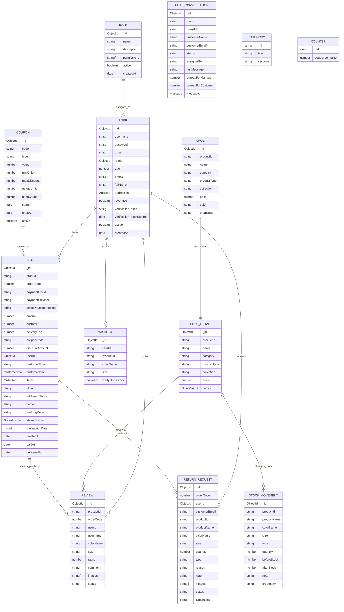

# Entity Relationship Diagram

MongoDB stores data as collections, with several embedded arrays for product variants, customer addresses, order items, status history, and chat messages.

## Collection Notes

| Collection | Primary Access Pattern | Important Indexes |
| --- | --- | --- |
| `role` | Find role by name during registration and guards | `name` unique |
| `users` | Login by username, lookup profile by id | `roleId` reference; add unique indexes for `username` and `email` in production |
| `shoes` | Product listing and admin listing | `productId` unique |
| `shoesDetail` | Product detail and nested stock mutation | Add `productId` unique/indexed in production |
| `bills` | Order lookup by order code, user order history, guest email history | `orderCode` unique, `paymentProvider`, `stripePaymentIntentId`, `status`, `fulfillmentStatus`, `createdAt`, `{userId, createdAt}`, `{customerEmail, createdAt}` |
| `coupons` | Validate coupon by code | `code` unique |
| `reviews` | List product reviews and enforce one verified review per order item | `productId`, `userId`, `status`, compound unique `{productId, orderCode, userId, colorName, size}` |
| `returnRequests` | Admin filter by status, user order history | `orderCode`, `userId`, `status` |
| `wishlist` | User wishlist and duplicate prevention | `userId`, `productId`, compound unique `{userId, productId, colorName, size}` |
| `stockMovements` | Audit stock history by product | `productId`, timestamps |
| `chatConversations` | Manager queue and user/guest active conversation | `{userId, status, updatedAt}`, `{guestId, status, updatedAt}`, `{status, updatedAt}` |

## Embedded Structures

| Parent | Embedded Structure | Purpose |
| --- | --- | --- |
| `users` | `addresses[]` | Shipping address book |
| `shoesDetail` | `colors[]`, `colors[].sizes[]` | Variant media, metadata, and stock by color/size |
| `bills` | `customerInfo`, `items[]`, `statusHistory[]` | Denormalized immutable checkout snapshot and fulfillment audit |
| `chatConversations` | `messages[]` | Conversation message timeline |

## Integrity Rules

1. `Bill.items[].productId` references `Shoe.productId` / `ShoeDetail.productId`.
2. `Bill.userId` may be `null` for guest checkout.
3. Reviews should be created only after a matching paid order item is found.
4. Return requests should reference an existing paid or delivered order.
5. Stock changes should update `shoesDetail.colors[].sizes[].stock` and append a `stockMovements` audit record when manually adjusted.
