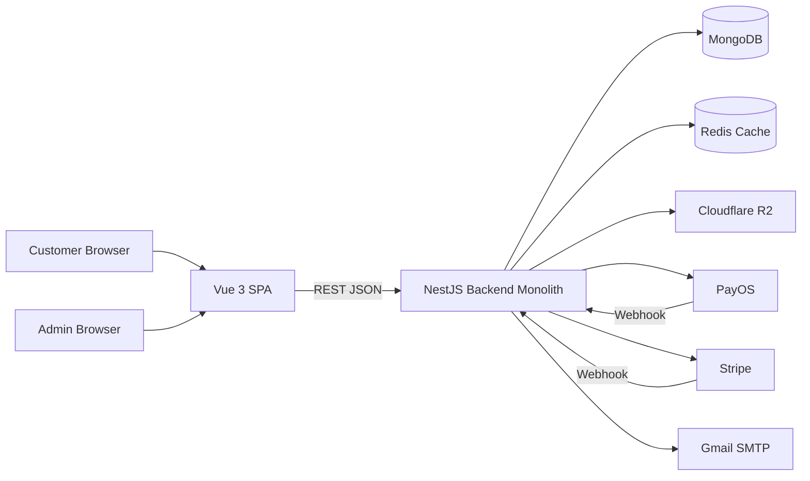
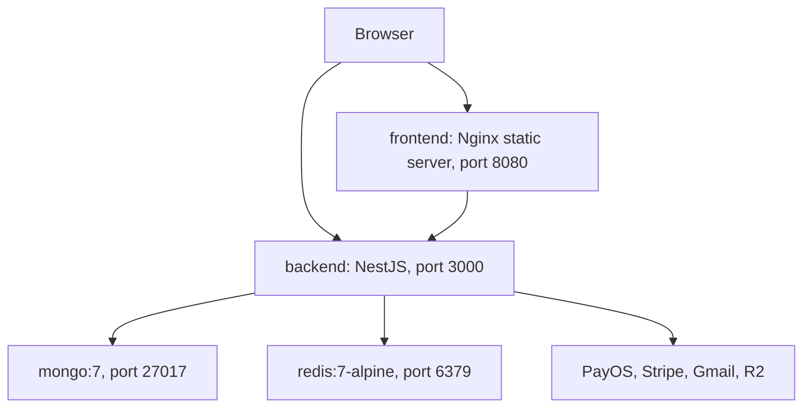
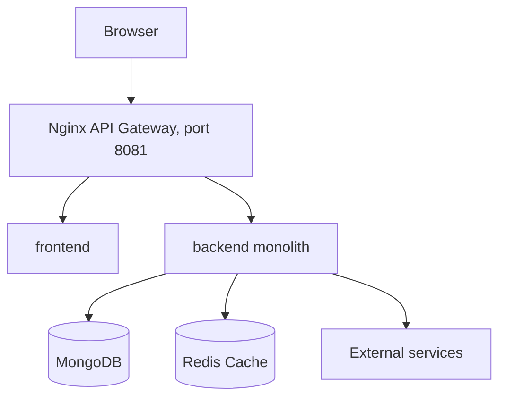

# High-Level Design

## 1. Purpose

Shoes Ecommerce is a full-stack Nike-style ecommerce application for browsing products, managing carts, checking out as guest or registered user, processing PayOS/Stripe payments, and operating an admin panel for products, inventory, orders, coupons, chat, and analytics.

This HLD describes the current production shape: a Vue SPA, a NestJS monolith, MongoDB, Redis, Cloudflare R2, PayOS, Stripe, and Gmail SMTP. The repository also contains an Nginx API gateway scaffold for a future microservice split.

## 2. Architecture Style

Current architecture: modular monolith.

Target evolution: microservice-ready monolith with API gateway. Business domains are already separated into NestJS modules, and the `services/api-gateway` folder can route traffic to extracted services later.

## 3. Technology Stack

| Layer | Technology |
| --- | --- |
| Frontend | Vue 3, Vite 7, Vue Router, Pinia, Tailwind CSS 4 |
| Backend | NestJS 11, TypeScript, Mongoose 8, Passport JWT |
| Database | MongoDB 7 |
| Cache | Redis 7 with ioredis |
| Payment | PayOS for Vietnam bank transfer/QR, Stripe Payment Intents |
| Media | Cloudflare R2 through S3-compatible SDK |
| Email | Nodemailer with Gmail SMTP |
| Packaging | Docker, Docker Compose, Nginx |
| CI/CD | GitHub Actions for Docker build, AWS ECS, Azure Container Apps |

## 4. Major Capabilities

| Capability | Frontend Surface | Backend Module | Data |
| --- | --- | --- | --- |
| Authentication and profile | Login, Register, Profile, Admin Users | `AuthModule` | `users`, `role` |
| Product catalog | Home, Products, Product Detail, Admin Products | `ShoesModule` | `shoes`, `shoesDetail`, `categories`, `counters` |
| Checkout and payment | Bag, Checkout, Payment, My Orders | `PaymentModule` | `bills`, `shoesDetail`, `coupons` |
| Inventory | Admin Inventory | `InventoryModule` | `stockMovements`, `shoesDetail` |
| Promotions | Admin Settings, Checkout coupon validation | `CouponsModule` | `coupons` |
| Reviews | Product Detail, My Orders | `ReviewsModule` | `reviews`, `shoesDetail` |
| Returns/refunds | My Orders, Admin Purchases | `ReturnsModule`, `PaymentModule` | `returnRequests`, `bills` |
| Wishlist | Wishlist, Product Detail, Header | `WishlistModule` | `wishlist` |
| Chat support | Chat Widget, Admin Chat | `ChatModule` | `chatConversations` |
| Analytics | Admin Dashboard, Admin Analytics | `AnalyticsModule`, `ShoesModule` | `bills`, `shoesDetail` |
| R2 media browser | Add/Edit Product form | `R2Module` | R2 bucket keys |

## 5. Key Data Flows

### Catalog Browse

1. User opens the Vue SPA.
2. Product list components call `GET /shoes` with optional filters.
3. Backend checks Redis for cached catalog responses, then reads `shoes`/`shoesDetail` on cache miss.
4. Product detail page calls `GET /shoes/detail/:productId`.
5. Product, inventory, and payment writes invalidate `shoes:*` cache keys.
6. UI stores cart/wishlist state in local storage and syncs wishlist with backend for logged-in users.

### Checkout

1. Cart is built on the frontend from local storage.
2. Checkout calls `POST /shoes/check-stock-batch`.
3. Checkout calls either `POST /payments` for PayOS or `POST /payments/stripe/create-intent` for Stripe.
4. Backend creates a `Bill` with `PENDING` status and payment metadata.
5. Payment provider callback confirms settlement.
6. Backend verifies webhook signature, marks order paid, decreases stock, records history, and sends email.

### Admin Operations

1. Admin logs in and stores a JWT in the browser.
2. Admin pages call backend APIs with `Authorization: Bearer <token>`.
3. Backend applies JWT and role guards on selected admin routes.
4. Admin can create products, adjust inventory, update fulfillment, hide reviews, manage coupons, and answer chat.

## 6. Deployment Topology

### Local Docker Compose

### Microservice Compose Scaffold

## 7. Cross-Cutting Design

| Concern | Current Design |
| --- | --- |
| Configuration | `.env` loaded by Nest `ConfigModule`; Vite uses build-time env vars |
| Validation | Global Nest `ValidationPipe` with whitelist, transform, forbid non-whitelisted |
| Authentication | JWT bearer token, 24h expiration |
| Authorization | Role guard for selected admin APIs; frontend route guard checks `admin`/`manager` |
| Webhook integrity | PayOS HMAC SHA-256 guard; Stripe raw body signature verification |
| Data consistency | Order settlement decreases stock after verified payment; cancellation can restore/refund |
| Media | R2 list/generate URL APIs for product media selection |
| Observability | Console logs and health endpoint; centralized structured logging is still future work |

## 8. Architectural Decisions

| Decision | Rationale | Consequence |
| --- | --- | --- |
| Use modular monolith first | Faster delivery, single deployable, simpler local setup | Need discipline around module boundaries before extracting services |
| Use MongoDB with embedded product variants | Product colors/sizes are naturally document-shaped | Stock updates must carefully edit nested arrays |
| Add Redis for catalog reads | Product listing/detail reads are frequent and derived from MongoDB | Cache invalidation must run after product, stock, and payment writes |
| Support guest checkout | Reduces friction and matches ecommerce expectations | Order lookup must validate email plus order code |
| Use PayOS and Stripe | Covers local Vietnam payments and international cards | Two provider-specific webhook paths and refund behaviors |
| Use R2 for media | Cheap object storage and CDN-friendly public URLs | Need admin tooling to list folders and generate media URLs |

## 9. Risks and Follow-Up Work

| Risk | Recommendation |
| --- | --- |
| Some user/profile endpoints are public by controller design | Add JWT ownership checks for profile/address/password updates |
| JWT stored in local storage | Prefer httpOnly secure cookies for production |
| CORS currently allows all origins | Restrict to configured frontend origins in production |
| API response formats are mixed | Introduce a standard envelope and error schema |
| No OpenAPI file generated | Add Swagger/OpenAPI generation from Nest decorators |
