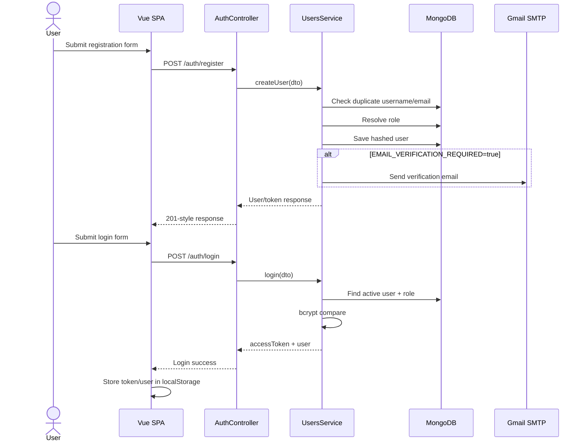
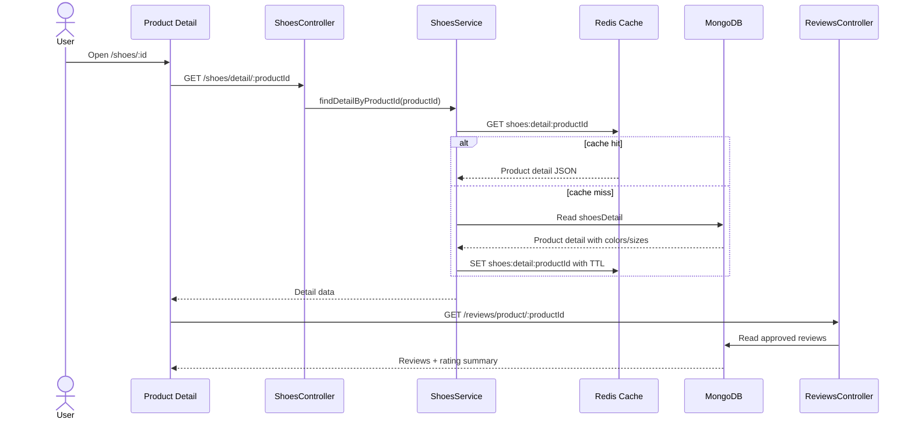
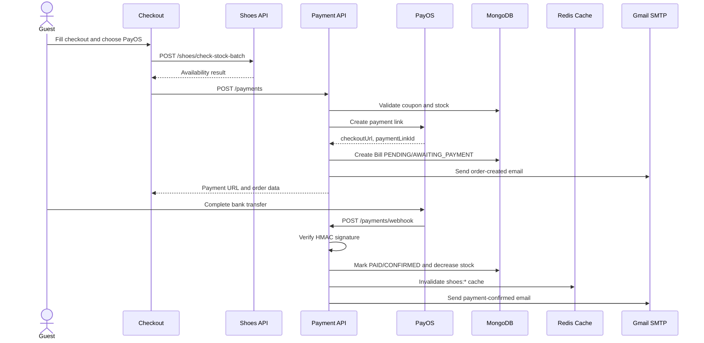
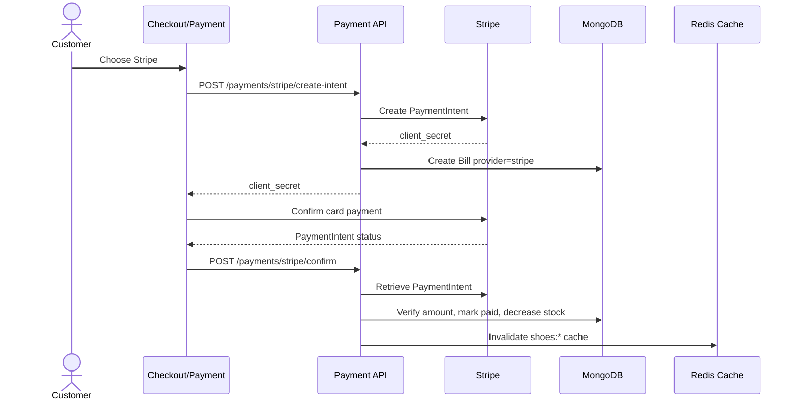
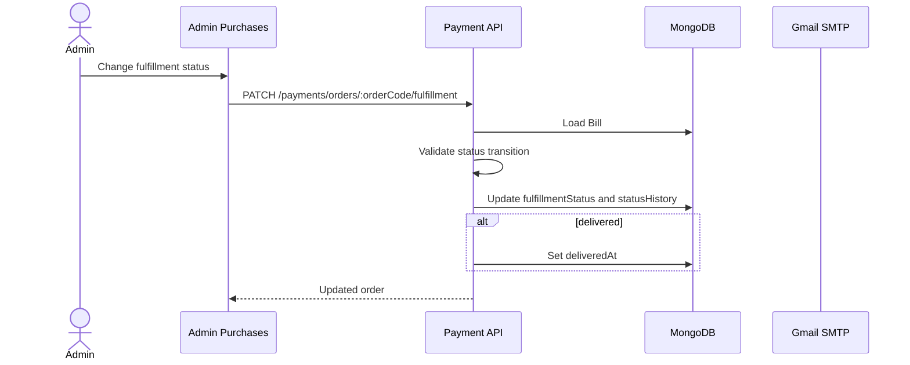
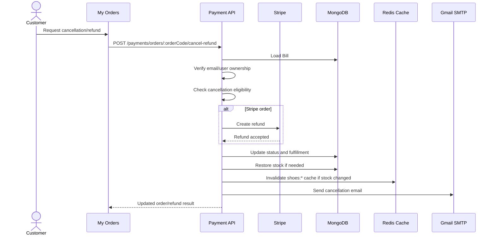
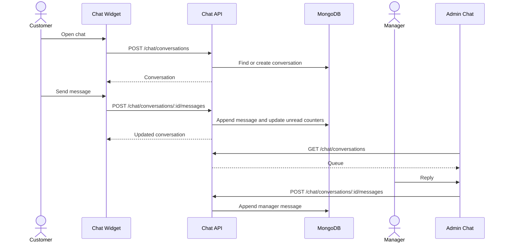

# Sequence Diagrams

This file keeps the primary end-to-end flows. The complete generated set for every use case is available in [sequence-diagrams-all-uc.md](sequence-diagrams-all-uc.md), with 76 rendered SVG diagrams and PlantUML sources.

## 1. Register and Login

## 2. Browse Product Detail

## 3. Guest Checkout with PayOS

## 4. Stripe Payment

## 5. Admin Fulfillment Update

## 6. Cancel and Refund Order

## 7. Customer Support Chat

