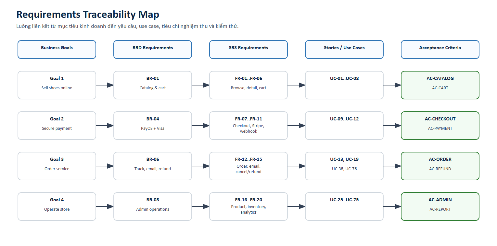

# Acceptance Criteria

Version: 1.0  
Date: 2026-05-19

## Criteria Matrix

| ID | Feature | Acceptance criteria |
| --- | --- | --- |
| AC-CATALOG-01 | Product listing | Given khách mở store, When API trả sản phẩm, Then danh sách hiển thị ảnh, tên, giá, màu và rating. |
| AC-CATALOG-02 | Product detail | Given khách chọn product, When vào detail, Then có gallery, color/size picker, stock và reviews. |
| AC-CART-01 | Cart | Given khách thêm item còn hàng, When bấm Add to Bag, Then item xuất hiện trong bag và lưu localStorage. |
| AC-CART-02 | Cart | Given stock không đủ, When tăng quantity quá tồn kho, Then hệ thống chặn và thông báo rõ. |
| AC-COUPON-01 | Coupon | Given coupon hợp lệ, When apply ở cart/checkout, Then total giảm đúng theo rule. |
| AC-CHECKOUT-01 | Guest checkout | Given guest nhập đủ email/phone/address, When đặt hàng, Then order được tạo và đi đến payment. |
| AC-CHECKOUT-02 | Logged-in checkout | Given user đăng nhập, When checkout, Then profile/address được prefill và order lưu vào lịch sử. |
| AC-PAYOS-01 | PayOS | Given PayOS callback hợp lệ, When webhook đến, Then order thành PAID, trừ stock và gửi email. |
| AC-STRIPE-01 | Stripe/Visa | Given thẻ thanh toán thành công, When Stripe webhook verified, Then order thành PAID và bag bị clear sau khi confirm. |
| AC-PAYMENT-ERR-01 | Payment error | Given payment bị lỗi hoặc blocked, When confirm thất bại, Then bag vẫn giữ nguyên và user thấy lỗi dễ hiểu. |
| AC-ORDER-01 | Guest order tracking | Given guest có email và mã đơn đúng, When tra cứu, Then hiển thị trạng thái và item của đơn. |
| AC-ORDER-02 | User order history | Given user đăng nhập đã mua hàng, When vào My Orders, Then thấy lịch sử và mở được detail. |
| AC-REFUND-01 | Cancel/refund allowed | Given order PAID và fulfillment CONFIRMED/PACKING, When customer hủy, Then status CANCELLED và refund được tạo. |
| AC-REFUND-02 | Cancel/refund blocked | Given order SHIPPING/DELIVERED, When customer hủy, Then hệ thống chặn và giải thích không thể hoàn tiền tự động. |
| AC-EMAIL-01 | Secure email | Given order thay đổi trạng thái, When gửi Gmail, Then email không chứa số thẻ, secret, token hoặc link nhạy cảm. |
| AC-WISHLIST-01 | Wishlist | Given user bấm icon tim, When item chưa có trong wishlist, Then item được lưu và hiển thị ở wishlist page. |
| AC-REVIEW-01 | Review | Given user đã mua sản phẩm, When gửi rating/comment, Then review được lưu và cập nhật rating trung bình. |
| AC-RETURN-01 | Returns | Given user tạo return request, When admin approve/reject/process/complete, Then user nhận được trạng thái mới. |
| AC-CHAT-01 | Live chat | Given guest/user gửi tin nhắn, When admin mở chat, Then thấy conversation và trả lời được. |
| AC-ADMIN-PRODUCT-01 | Admin products | Given admin tạo/cập nhật product, When lưu, Then storefront hiển thị dữ liệu mới đúng variant. |
| AC-ADMIN-ORDER-01 | Admin orders | Given admin chuyển PACKING -> SHIPPING, When nhập carrier/tracking, Then order history và email có tracking. |
| AC-INVENTORY-01 | Inventory | Given admin adjust stock, When quantity hợp lệ, Then stock thay đổi và movement log được ghi. |
| AC-COUPON-ADMIN-01 | Admin coupons | Given admin tạo coupon trùng code, When submit, Then hệ thống trả lỗi conflict. |
| AC-USER-ADMIN-01 | Admin users | Given admin đổi role user khác, When submit hợp lệ, Then role cập nhật và không cho tự đổi role chính mình. |
| AC-ANALYTICS-01 | Analytics | Given admin chọn date range, When dashboard load, Then metrics/charts phản ánh đúng khoảng thời gian. |

## Release Gate Checklist

- Run customer checkout test for guest PayOS, guest Stripe/Visa and logged-in checkout.
- Verify bag is preserved on failed/blocked payment and cleared only on confirmed success.
- Verify Gmail order email contains safe order details only.
- Verify cancel/refund allows PAID + CONFIRMED/PACKING and blocks SHIPPING/DELIVERED.
- Verify wishlist, order history and admin order detail work without stale UI or unwanted overlay.

