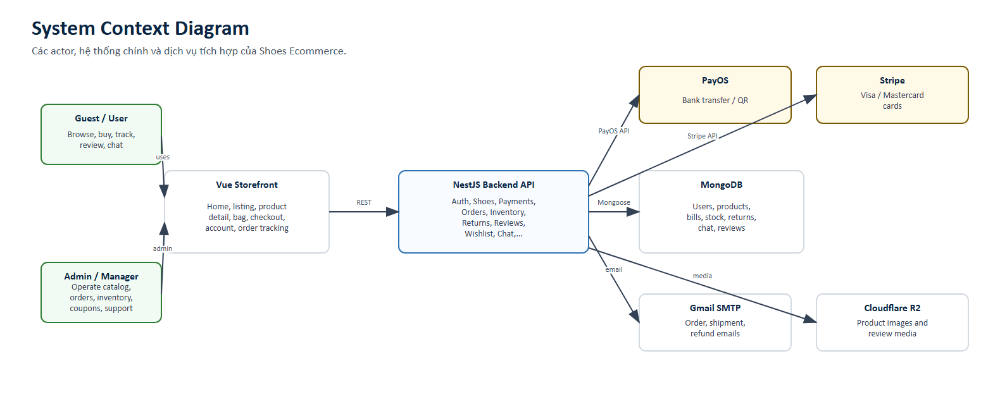
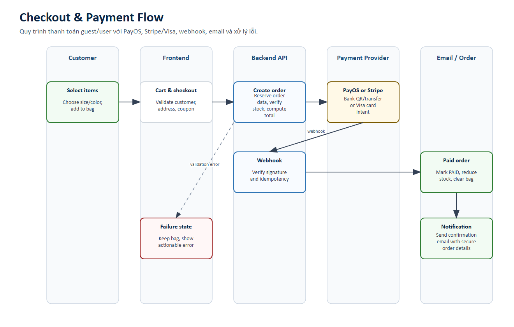
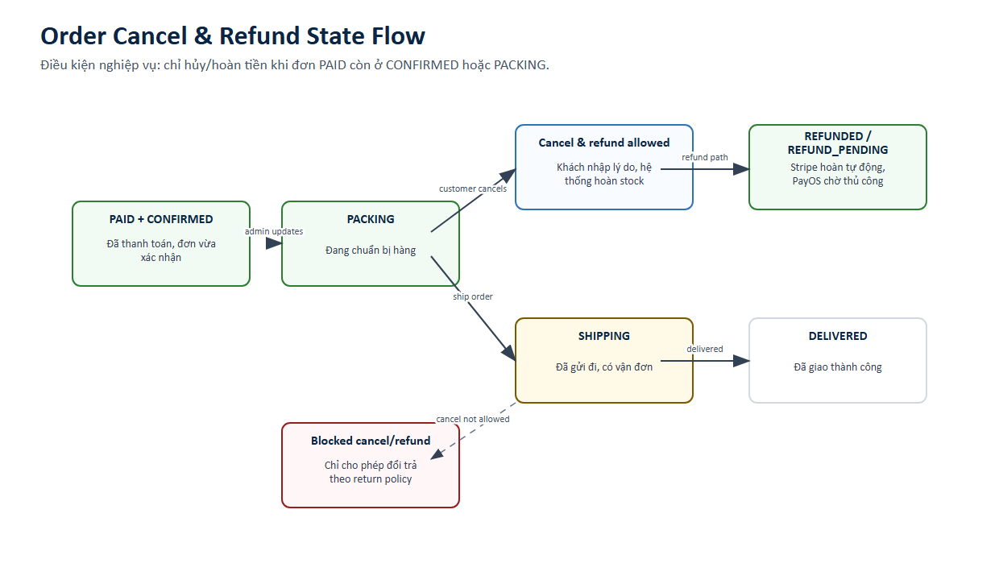
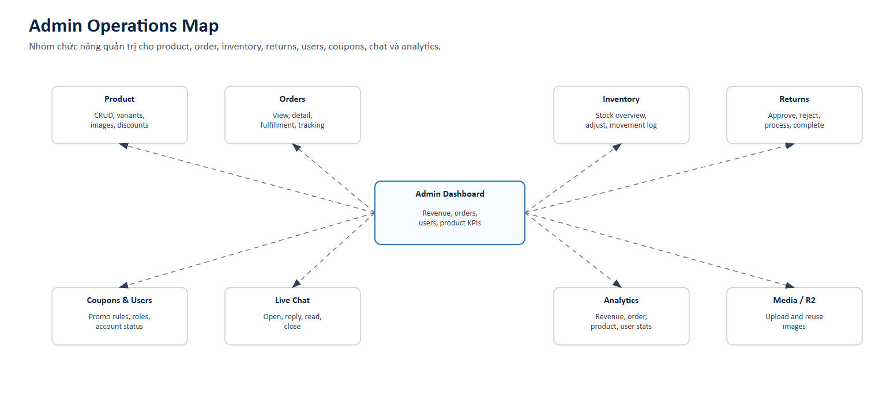

# Software Requirements Specification (SRS)

Version: 1.0  
Date: 2026-05-19

## System Overview

Frontend Vue 3/Vite/TailwindCSS, backend NestJS, MongoDB/Mongoose, Redis cache, PayOS, Stripe, Gmail SMTP và Cloudflare R2.

## Functional Requirements

| ID | Name | Requirement | Use cases |
| --- | --- | --- | --- |
| FR-01 | Product listing | Hệ thống phải hiển thị danh sách sản phẩm với ảnh, giá, màu, rating và trạng thái hàng. | UC-01 |
| FR-02 | Search and filter | Hệ thống phải lọc theo category, color, size, price và text search. | UC-02 |
| FR-03 | Product detail | Hệ thống phải hiển thị gallery, variant, size, stock, mô tả và review. | UC-03, UC-04, UC-05 |
| FR-04 | Cart | Hệ thống phải thêm/xóa/sửa số lượng và tính tổng tiền, coupon, discount. | UC-06, UC-07, UC-08 |
| FR-05 | Guest checkout | Hệ thống phải nhận thông tin guest và tạo đơn không cần đăng nhập. | UC-09, UC-13 |
| FR-06 | Logged-in checkout | Hệ thống phải prefill profile/address và lưu lịch sử đơn cho user. | UC-18, UC-19 |
| FR-07 | PayOS payment | Hệ thống phải tạo payment link/QR, verify webhook và cập nhật PAID. | UC-10, UC-12 |
| FR-08 | Stripe card payment | Hệ thống phải tạo PaymentIntent, xác nhận thẻ và verify Stripe webhook. | UC-11, UC-12 |
| FR-09 | Order email | Hệ thống phải gửi email xác nhận, cập nhật shipping, cancel/refund. | UC-38, UC-52, UC-76 |
| FR-10 | Order tracking | Hệ thống phải cho guest/user xem trạng thái và chi tiết đơn. | UC-13, UC-19 |
| FR-11 | Cancel/refund | Hệ thống phải cho khách hủy/hoàn tiền khi PAID và CONFIRMED/PACKING. | UC-76 |
| FR-12 | Wishlist | Hệ thống phải cho user quản lý wishlist và chuyển item sang cart. | UC-23 |
| FR-13 | Review | Hệ thống phải cho user đã mua sản phẩm viết review kèm ảnh. | UC-20 |
| FR-14 | Returns | Hệ thống phải cho user tạo/track return và admin xử lý return. | UC-21, UC-22, UC-46..UC-52 |
| FR-15 | Live chat | Hệ thống phải hỗ trợ chat guest/user và quản trị hội thoại. | UC-24, UC-68..UC-75 |
| FR-16 | Product admin | Admin phải CRUD product, variants, images, discount. | UC-25..UC-31 |
| FR-17 | Order admin | Admin phải xem, lọc, cập nhật fulfillment, tracking và note. | UC-32..UC-39 |
| FR-18 | Inventory admin | Admin phải xem, cảnh báo, điều chỉnh và audit stock movement. | UC-40..UC-45 |
| FR-19 | Coupon/user admin | Admin phải quản lý coupon, users, roles và disable account. | UC-53..UC-60 |
| FR-20 | Analytics | Admin phải xem/export dashboard theo doanh thu, đơn, sản phẩm, user. | UC-61..UC-67 |

## Non-Functional Requirements

| ID | Quality | Specification |
| --- | --- | --- |
| NFR-01 | Security | JWT bảo vệ API, RBAC cho admin/manager, không log card data, verify webhook signature. |
| NFR-02 | Privacy | Email/order detail chỉ chứa dữ liệu cần thiết; không gửi số thẻ, secret, token hoặc thông tin nhạy cảm. |
| NFR-03 | Reliability | Webhook xử lý idempotent; lỗi email không làm fail thanh toán đã thành công. |
| NFR-04 | Usability | Bag không bị xóa nếu thanh toán lỗi; lỗi phải rõ ràng và có hành động tiếp theo. |
| NFR-05 | Performance | Product listing dùng lazy/virtual loading; catalog read API dùng Redis cache với TTL ngắn; API phân trang cho admin order/user/coupon. |
| NFR-06 | Maintainability | Backend module hóa theo auth, shoes, payment, inventory, returns, reviews, wishlist, chat, analytics. |
| NFR-07 | Observability | Log webhook, email, refund, inventory movement và fulfillment history. |
| NFR-08 | Scalability | Media dùng R2, frontend/backend container hóa và có hướng tách microservice. |
| NFR-09 | Data integrity | Stock phải giảm sau khi payment PAID và hoàn lại khi cancel/refund hợp lệ. |
| NFR-10 | Compatibility | Stripe Elements chạy trên trình duyệt hiện đại; PayOS redirect hoạt động với mobile/desktop. |

## Diagrams

