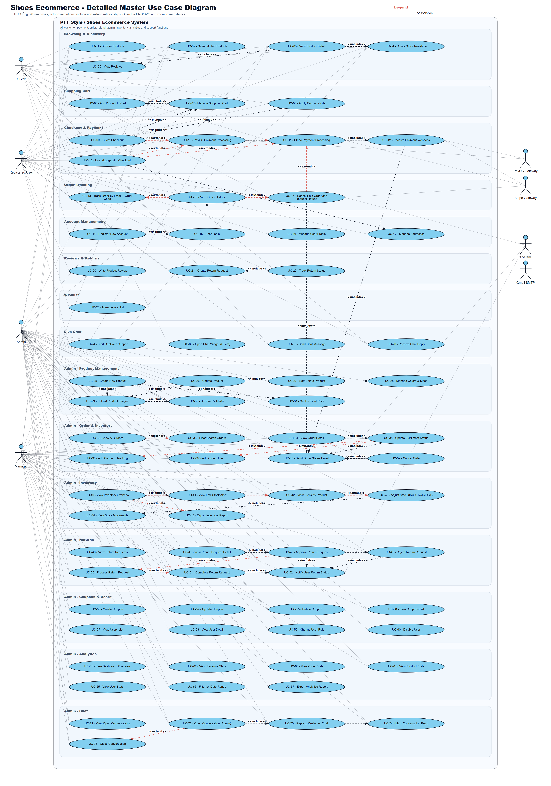

# User Stories and Use Cases

Version: 1.0  
Date: 2026-05-19

## User Stories

| ID | As a | I want to | So that | UC |
| --- | --- | --- | --- | --- |
| US-01 | Guest | xem nhanh các sản phẩm nổi bật | tìm được sản phẩm phù hợp mà không cần đăng nhập | UC-01 |
| US-02 | Guest | lọc giày theo màu, size và giá | rút ngắn thời gian tìm kiếm | UC-02 |
| US-03 | Guest | xem chi tiết size, tồn kho và review | tự tin trước khi thêm vào bag | UC-03..UC-05 |
| US-04 | Guest | mua hàng không cần tài khoản | checkout nhanh | UC-09 |
| US-05 | Guest | tra cứu đơn bằng email và mã đơn | biết trạng thái sau khi mua | UC-13 |
| US-06 | User | đăng ký và đăng nhập | quản lý hồ sơ và lịch sử mua | UC-14..UC-17 |
| US-07 | User | lưu địa chỉ mặc định | checkout ít nhập liệu hơn | UC-17, UC-18 |
| US-08 | User | xem lịch sử mua hàng | theo dõi các đơn đã thanh toán | UC-19 |
| US-09 | User | hủy đơn và nhận hoàn tiền khi đơn còn chuẩn bị | xử lý nhầm size/màu kịp thời | UC-76 |
| US-10 | User | lưu sản phẩm yêu thích | quay lại mua sau dễ hơn | UC-23 |
| US-11 | User | review sản phẩm đã mua | chia sẻ trải nghiệm cho khách khác | UC-20 |
| US-12 | User | tạo yêu cầu đổi trả | được hỗ trợ sau bán hàng | UC-21, UC-22 |
| US-13 | Guest/User | nhắn support | được giải đáp trước và sau khi mua | UC-24, UC-68..UC-70 |
| US-14 | Admin | tạo và cập nhật sản phẩm nhiều biến thể | catalog luôn chính xác | UC-25..UC-31 |
| US-15 | Admin | theo dõi đơn và cập nhật vận chuyển | khách biết tiến độ giao hàng | UC-32..UC-38 |
| US-16 | Admin | quản lý tồn kho và cảnh báo low stock | tránh bán quá hàng | UC-40..UC-45 |
| US-17 | Admin | xử lý return/refund | dịch vụ hậu mãi minh bạch | UC-46..UC-52 |
| US-18 | Admin | quản lý coupon | chạy chiến dịch giảm giá an toàn | UC-53..UC-56 |
| US-19 | Admin | quản lý user và role | bảo vệ quyền truy cập hệ thống | UC-57..UC-60 |
| US-20 | Manager | xem analytics theo ngày | ra quyết định nhập hàng và marketing | UC-61..UC-67 |
| US-21 | Admin/Manager | trả lời live chat | không bỏ sót khách cần hỗ trợ | UC-71..UC-75 |

## Master Use Case Diagram

## Use Case Catalog

| ID | Category | Actor | Use case | Goal |
| --- | --- | --- | --- | --- |
| UC-01 | Browsing & Discovery | Guest, User | Browse Products | Xem danh sách sản phẩm ở trang chủ/listing. |
| UC-02 | Browsing & Discovery | Guest, User | Search/Filter Products | Tìm, lọc theo category, color, size, price. |
| UC-03 | Browsing & Discovery | Guest, User | View Product Detail | Xem ảnh, màu, size, giá, mô tả và review. |
| UC-04 | Browsing & Discovery | Guest, User | Check Stock Real-time | Kiểm tra tồn kho theo màu và size. |
| UC-05 | Browsing & Discovery | Guest, User | View Reviews | Xem rating và nhận xét của người mua. |
| UC-06 | Shopping Cart | Guest, User | Add Product to Cart | Thêm sản phẩm đã chọn size/màu vào bag. |
| UC-07 | Shopping Cart | Guest, User | Manage Shopping Cart | Tăng giảm số lượng, xóa item, tính lại tổng. |
| UC-08 | Shopping Cart | Guest, User | Apply Coupon Code | Áp mã giảm giá hợp lệ trước thanh toán. |
| UC-09 | Checkout & Payment | Guest | Guest Checkout | Mua hàng không cần tài khoản, nhập thông tin giao hàng. |
| UC-10 | Checkout & Payment | Guest, User, PayOS | PayOS Payment Processing | Thanh toán qua QR/chuyển khoản ngân hàng. |
| UC-11 | Checkout & Payment | Guest, User, Stripe | Stripe/Visa Payment Processing | Thanh toán bằng thẻ Visa/Mastercard qua Stripe. |
| UC-12 | Checkout & Payment | PayOS, Stripe, System | Receive Payment Webhook | Xác thực webhook, cập nhật PAID, trừ kho, gửi email. |
| UC-13 | Order Tracking | Guest | Track Order by Email + Order Code | Tra cứu đơn guest bằng email và mã đơn. |
| UC-14 | Account Management | Guest | Register New Account | Tạo tài khoản, validate email/username/password. |
| UC-15 | Account Management | Guest | User Login | Đăng nhập, nhận access/refresh token. |
| UC-16 | Account Management | User | Manage User Profile | Cập nhật họ tên, số điện thoại, avatar. |
| UC-17 | Account Management | User | Manage Addresses | Thêm/sửa/xóa địa chỉ và đặt mặc định. |
| UC-18 | Checkout & Payment | User | User Checkout | Checkout khi đã đăng nhập, dùng profile/address lưu sẵn. |
| UC-19 | Order Tracking | User | View Order History | Xem lịch sử mua hàng trong tài khoản. |
| UC-20 | Reviews & Returns | User | Write Product Review | Review sản phẩm đã mua, rating và ảnh. |
| UC-21 | Reviews & Returns | User | Create Return Request | Tạo yêu cầu trả/đổi/hoàn tiền. |
| UC-22 | Reviews & Returns | User | Track Return Status | Theo dõi trạng thái yêu cầu đổi trả. |
| UC-23 | Wishlist | User | Manage Wishlist | Lưu/xóa sản phẩm yêu thích, thêm vào cart. |
| UC-24 | Live Chat | User | Start Chat with Support | Mở cuộc trò chuyện với hỗ trợ. |
| UC-25 | Admin - Product Management | Admin | Create New Product | Tạo product với variant màu/size/tồn kho. |
| UC-26 | Admin - Product Management | Admin | Update Product | Cập nhật sản phẩm, giá, ảnh, stock. |
| UC-27 | Admin - Product Management | Admin | Soft Delete Product | Ẩn sản phẩm khỏi store mà giữ dữ liệu. |
| UC-28 | Admin - Product Management | Admin | Manage Colors & Sizes | Quản lý biến thể màu và size. |
| UC-29 | Admin - Product Management | Admin | Upload Product Images | Upload ảnh lên Cloudflare R2. |
| UC-30 | Admin - Product Management | Admin | Browse R2 Media | Chọn lại ảnh đã upload trong R2. |
| UC-31 | Admin - Product Management | Admin | Set Discount Price | Thiết lập giá sale theo sản phẩm. |
| UC-32 | Admin - Order & Inventory | Admin, Manager | View All Orders | Xem danh sách toàn bộ đơn hàng. |
| UC-33 | Admin - Order & Inventory | Admin, Manager | Filter/Search Orders | Lọc order theo status, ngày, từ khóa. |
| UC-34 | Admin - Order & Inventory | Admin, Manager | View Order Detail | Xem đầy đủ thông tin đơn, khách, thanh toán, item. |
| UC-35 | Admin - Order & Inventory | Admin, Manager | Update Fulfillment Status | Chuyển trạng thái chuẩn bị, giao, hoàn tất. |
| UC-36 | Admin - Order & Inventory | Admin, Manager | Add Carrier + Tracking | Thêm hãng vận chuyển và mã tracking. |
| UC-37 | Admin - Order & Inventory | Admin, Manager | Add Order Note | Ghi chú nội bộ vào đơn hàng. |
| UC-38 | Admin - Order & Inventory | System | Send Order Status Email | Gửi email khi trạng thái đơn thay đổi. |
| UC-39 | Admin - Order & Inventory | Admin, Manager | Cancel Order | Admin hủy đơn hợp lệ và hoàn stock. |
| UC-40 | Admin - Inventory | Admin, Manager | View Inventory Overview | Xem tổng quan tồn kho. |
| UC-41 | Admin - Inventory | Admin, Manager | View Low Stock Alert | Xem cảnh báo sắp hết hàng. |
| UC-42 | Admin - Inventory | Admin, Manager | View Stock by Product | Xem tồn kho chi tiết theo product/color/size. |
| UC-43 | Admin - Inventory | Admin, Manager | Adjust Stock (IN/OUT/ADJUST) | Điều chỉnh tồn kho và ghi audit trail. |
| UC-44 | Admin - Inventory | Admin, Manager | View Stock Movements | Xem lịch sử biến động tồn kho. |
| UC-45 | Admin - Inventory | Admin, Manager | Export Inventory Report | Xuất báo cáo tồn kho. |
| UC-46 | Admin - Returns | Admin, Manager | View Return Requests | Xem danh sách yêu cầu đổi trả. |
| UC-47 | Admin - Returns | Admin, Manager | View Return Request Detail | Xem chi tiết yêu cầu đổi trả. |
| UC-48 | Admin - Returns | Admin, Manager | Approve Return Request | Duyệt yêu cầu đổi trả. |
| UC-49 | Admin - Returns | Admin, Manager | Reject Return Request | Từ chối yêu cầu đổi trả. |
| UC-50 | Admin - Returns | Admin, Manager | Process Return Request | Chuyển yêu cầu sang đang xử lý. |
| UC-51 | Admin - Returns | Admin, Manager | Complete Return Request | Hoàn tất yêu cầu đổi trả. |
| UC-52 | Admin - Returns | System | Notify User Return Status | Gửi email cập nhật đổi trả. |
| UC-53 | Admin - Coupons & Users | Admin, Manager | Create Coupon | Tạo coupon theo % hoặc số tiền. |
| UC-54 | Admin - Coupons & Users | Admin, Manager | Update Coupon | Cập nhật điều kiện coupon. |
| UC-55 | Admin - Coupons & Users | Admin, Manager | Delete Coupon | Xóa/vô hiệu hóa coupon. |
| UC-56 | Admin - Coupons & Users | Admin, Manager | View Coupons List | Xem danh sách coupon. |
| UC-57 | Admin - Coupons & Users | Admin | View Users List | Xem danh sách người dùng. |
| UC-58 | Admin - Coupons & Users | Admin | View User Detail | Xem thông tin chi tiết user. |
| UC-59 | Admin - Coupons & Users | Admin | Change User Role | Đổi role user theo RBAC. |
| UC-60 | Admin - Coupons & Users | Admin | Disable User | Khóa tài khoản người dùng. |
| UC-61 | Admin - Analytics | Admin, Manager | View Dashboard Overview | Xem doanh thu, đơn hàng, sản phẩm, user. |
| UC-62 | Admin - Analytics | Admin, Manager | View Revenue Stats | Xem biểu đồ doanh thu. |
| UC-63 | Admin - Analytics | Admin, Manager | View Order Stats | Xem thống kê đơn hàng. |
| UC-64 | Admin - Analytics | Admin, Manager | View Product Stats | Xem thống kê sản phẩm bán chạy. |
| UC-65 | Admin - Analytics | Admin | View User Stats | Xem thống kê người dùng. |
| UC-66 | Admin - Analytics | Admin, Manager | Filter by Date Range | Lọc dashboard theo thời gian. |
| UC-67 | Admin - Analytics | Admin | Export Analytics Report | Xuất báo cáo analytics. |
| UC-68 | Live Chat | Guest | Open Chat Widget (Guest) | Guest nhập tên/email để mở chat. |
| UC-69 | Live Chat | Guest, User | Send Chat Message | Gửi tin nhắn hỗ trợ. |
| UC-70 | Live Chat | Guest, User | Receive Chat Reply | Nhận phản hồi từ admin/support. |
| UC-71 | Admin - Chat | Admin, Manager | View Open Conversations | Xem hội thoại đang mở. |
| UC-72 | Admin - Chat | Admin, Manager | Open Conversation (Admin) | Mở chi tiết hội thoại. |
| UC-73 | Admin - Chat | Admin, Manager | Reply to Customer Chat | Trả lời khách hàng. |
| UC-74 | Admin - Chat | Admin, Manager | Mark Conversation Read | Đánh dấu hội thoại đã đọc. |
| UC-75 | Admin - Chat | Admin, Manager | Close Conversation | Đóng hội thoại hỗ trợ. |
| UC-76 | Order Tracking | Guest, User | Cancel Paid Order and Request Refund | Hủy đơn PAID khi còn chuẩn bị hàng và hoàn tiền. |
