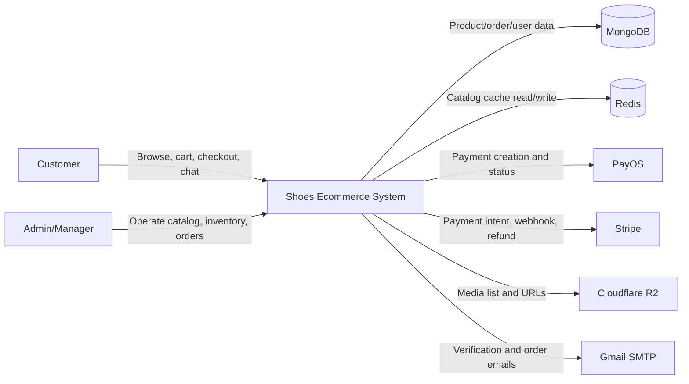
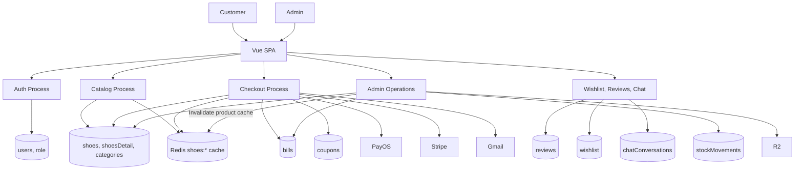
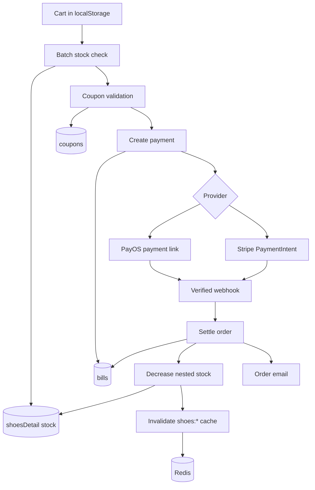
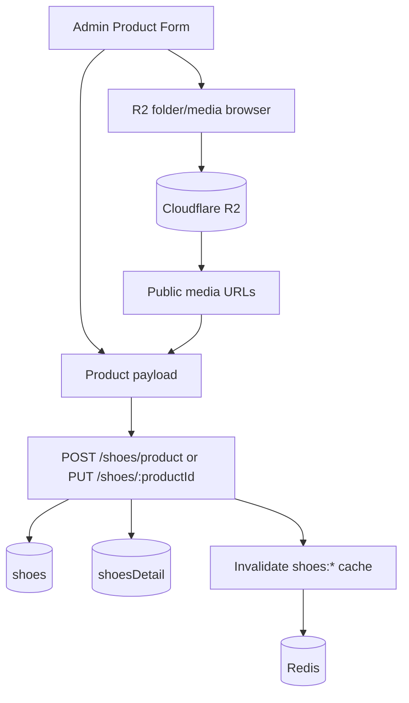
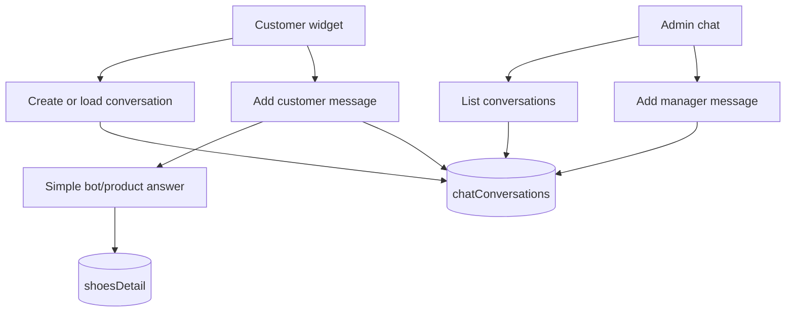

# Data Flow Diagram

## DFD Level 0

## DFD Level 1

## DFD Level 2: Checkout

## DFD Level 2: Admin Product and Media

## DFD Level 2: Chat Support

## Data Classification

| Data | Examples | Storage | Sensitivity |
| --- | --- | --- | --- |
| Account data | username, email, phone, address | MongoDB `users` | High |
| Auth secrets | password hashes, JWT secret | MongoDB/env | High |
| Payment metadata | provider ids, order amount, transaction payload | MongoDB `bills` | High |
| Product data | name, price, stock, media URLs | MongoDB/R2 | Medium |
| Product cache | derived product list/detail responses | Redis `shoes:*` keys | Low/Medium |
| Chat/review content | free text, images | MongoDB/R2 URLs | Medium |
| Analytics | revenue totals, order counts | Aggregated from MongoDB | Medium |

## Data Retention Suggestions

1. Keep order records for accounting/legal retention requirements.
2. Keep stock movement audit logs indefinitely or archive yearly.
3. Expire email verification tokens after 24 hours and clear used tokens.
4. Consider retention policy for chat conversations and uploaded review/return images.
5. Keep Redis product cache short-lived, default 300 seconds, because MongoDB remains the source of truth.
