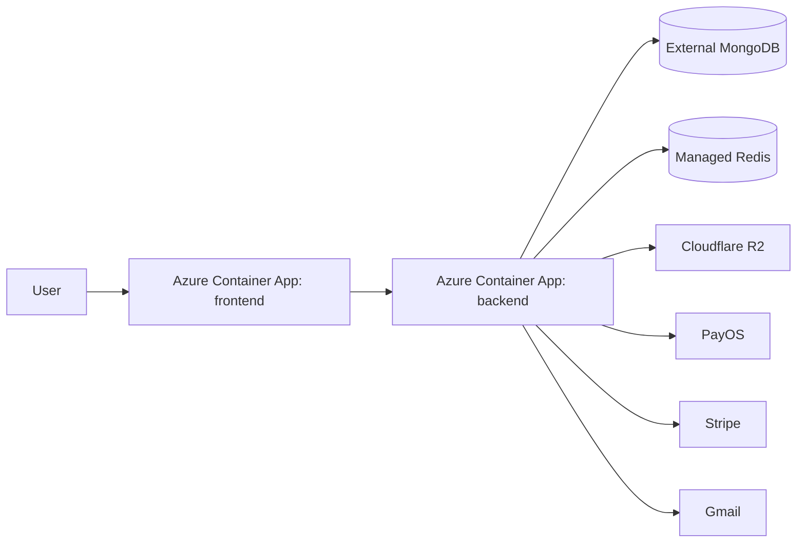
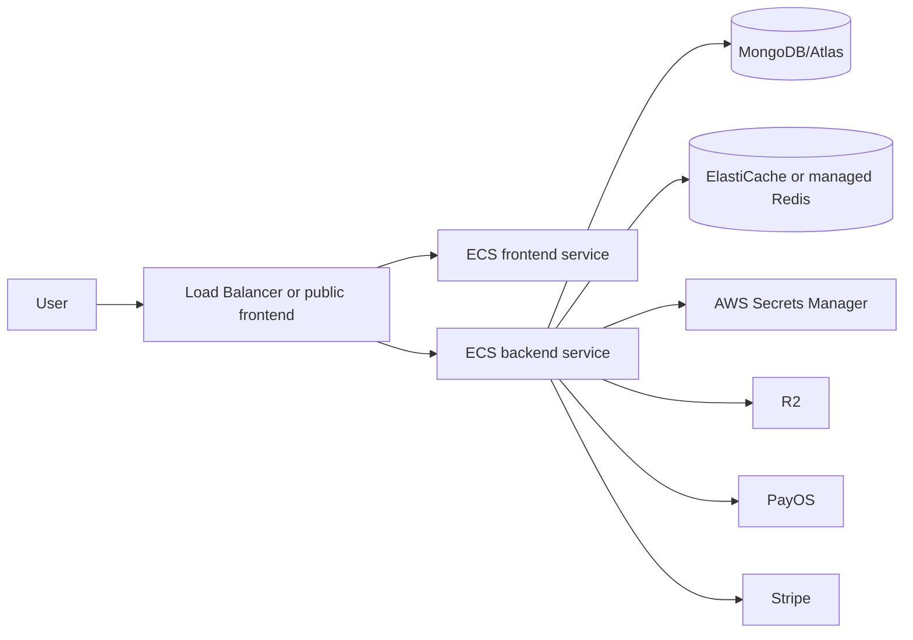

# Deployment Architecture

## 1. Local Development

### Backend

```powershell
cd nike-store-nest-js
npm install
npm run start:dev
```

Backend listens on `http://localhost:3000`.

### Frontend

```powershell
cd tailwind4-vue3-nikeStore
npm install
npm run dev
```

Vite listens on `http://localhost:5173` unless another port is selected.

### MongoDB and Redis

Use local MongoDB/Redis or Docker Compose services:

```powershell
docker compose up mongo
docker compose up redis
```

## 2. Local Docker Compose

```powershell
docker compose up --build
```

| Service | Container | Port |
| --- | --- | --- |
| MongoDB | `shoes-mongo` | `27017:27017` |
| Redis | `shoes-redis` | `6379:6379` |
| Backend | `shoes-backend` | `3000:3000` |
| Frontend | `shoes-frontend` | `8080:80` |

The backend uses `MONGO_URI=mongodb://mongo:27017/nike-store` and `REDIS_URL=redis://redis:6379/0` inside the compose network.

## 3. Gateway/Microservice Compose

```powershell
docker compose -f docker-compose.microservices.yml up --build
```

| Service | Purpose | Port |
| --- | --- | --- |
| `gateway` | Nginx gateway and SPA/API router | `8081:8080` |
| `frontend` | Static Vue app | internal |
| `backend` | NestJS monolith | internal `3000` |
| `mongo` | MongoDB | host `27018`, container `27017` |
| `redis` | Product catalog cache | host `6380`, container `6379` |

Gateway routing:

| Gateway Path | Upstream |
| --- | --- |
| `/` | frontend |
| `/api/auth/` | backend `/auth/` |
| `/api/shoes/` | backend `/shoes/` |
| `/api/inventory/` | backend `/inventory/` |
| `/api/payments/` | backend `/payments/` |
| `/api/coupons/` | backend `/coupons/` |
| `/api/chat/` | backend `/chat/` |
| `/api/reviews/` | backend `/reviews/` |
| `/api/returns/` | backend `/returns/` |

## 4. Azure Container Apps

Supported by:

| File | Purpose |
| --- | --- |
| `.github/workflows/deploy-azure-container-apps.yml` | Manual GitHub Actions deployment |
| `scripts/azure/deploy-container-apps.ps1` | Local PowerShell deployment script |
| `infra/azure/container-apps.example.yml` | Example app definitions |
| `scripts/azure/scale-container-apps-to-zero.ps1` | Cost control helper |

Architecture:



Production secrets are passed as Container Apps secrets and referenced as environment variables.

## 5. AWS ECS

Supported by:

| File | Purpose |
| --- | --- |
| `.github/workflows/deploy-aws-ecr-ecs.yml` | Manual deployment to ECR/ECS |
| `scripts/aws/push-ecr-images.ps1` | Build and push backend/frontend images |
| `infra/aws/ecs-backend-task-definition.example.json` | Backend ECS task definition example |

Architecture:



## 6. Deployment Checklist

1. Build backend and frontend with `npm ci` and `npm run build`.
2. Set production env vars and secrets.
3. Confirm `JWT_SECRET` is strong and not a fallback.
4. Confirm `REDIS_URL` points to a private managed Redis instance and `REDIS_PRODUCTS_TTL_SECONDS` is set intentionally.
5. Confirm `VITE_API_BASE_URL` points to the public backend or gateway.
6. Confirm PayOS return/cancel URLs point to frontend `/payment` and `/checkout`.
7. Configure Stripe webhook endpoint and `STRIPE_WEBHOOK_SECRET`.
8. Configure R2 bucket credentials and public URL.
9. Run smoke test: `scripts/local/smoke-test.ps1`.
10. Verify `/health`, `/shoes`, checkout sandbox flow, and admin login.

## 7. Rollback Strategy

| Deployment Type | Rollback |
| --- | --- |
| Docker Compose | Rebuild previous git commit or image tag, then `docker compose up -d` |
| Azure Container Apps | Update app image to previous tag/revision |
| AWS ECS | Re-deploy previous task definition revision |
| Database | Restore MongoDB backup; avoid destructive schema changes without migration |
